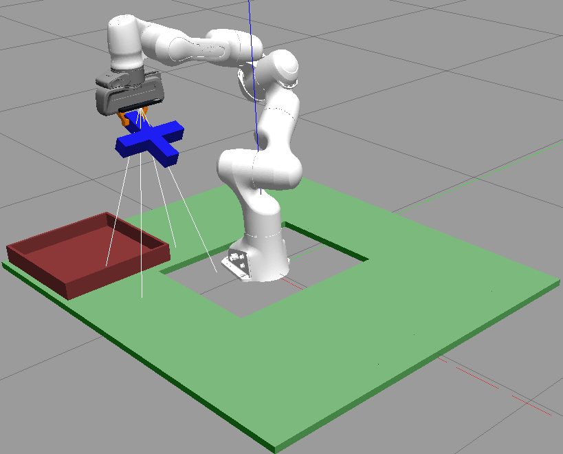

# Pick-n-Place Manipulation using 7-DOF Panda Robot Arm

This repository contains the implementation of a robust robotic perception and manipulation system that autonomously detects, classifies, and manipulates geometric shapes in a simulated Gazebo environment using a Franka Emika Panda 7-DOF robot arm.

## Project Overview

This project showcases advanced robotics skills by solving three progressively complex, real-world manipulation challenges:

1.  **Precision Pick and Place:** Shape-specific grasp planning for precise pick-n-place operations of crosses and noughts.
2.  **Adaptive Shape Classification:** Dynamic classification of shapes on a surface with variable height, ensuring environmental robustness.
3.  **Cluttered Environment Navigation:** Object identification and retrieval in complex scenes with obstacles, requiring sophisticated path planning and object selection.

  

---

## Technologies Used ⚙️

| Area | Tools & Frameworks |
| :--- | :--- |
| **Robotics & Simulation** | ROS (Kinetic/Melodic/Noetic), Gazebo, MoveIt!, Franka Emika Panda (7-DOF) |
| **Perception & CV** | PCL (Point Cloud Library), OpenCV, Python |
| **Motion Planning** | MoveIt! |

---

## System Highlights

### Advanced Perception

-   Point cloud segmentation and filtering for dynamic cluster extraction
-   2D/3D shape classification using contour and hole detection
-   Dynamic object detection with environment-adaptive parameter tuning
-   **Novelty:** Integration of dynamic table height detection for robust perception (Task 2)

### Intelligent Manipulation

-   Shape-specific grasp planning (custom strategies for crosses and noughts)
-   Orientation-aware approach strategies for secure grasping
-   Collision-free path planning using MoveIt!
-   **Novelty:** Sophisticated scoring algorithm for optimal object selection in cluttered scenes (Task 3)

### Robust System Design

-   Comprehensive error handling and recovery strategies
-   Real-time system monitoring and visualization in Rviz
-   Dynamic parameter adjustment based on environmental conditions

---

## Challenge Breakdown

### Task 1: Precision Pick and Place Shape Manipulation

**Focus:** Demonstrating precise, shape-aware grasping and controlled pick-and-place movement.

#### Key Innovation

The system achieves high-reliability manipulation through customized strategies:

* **Shape-Specific Grasping:** Applies different grasp points and lateral offsets for crosses versus noughts.
* **Orientation-Aware Approach:** Utilizes OpenCV analysis (primary axes and contour detection) to align the gripper perfectly with the object's orientation before descent.
* **Robust Movement Execution:** Includes carefully controlled trajectories for pre-grasp approach, stable lifting, and gentle placement to prevent tipping or dropping.

#### Results

The system successfully performs reliable, stable pick-and-place operations for both cross and nought shapes.

  
  
<em>Example of the robot transporting an object to the basket.</em>

---

### Task 2: Adaptive Shape Classification with Variable Table Height

**Focus:** Implementing environmental adaptability and rotation-invariant shape classification.

#### Key Innovation

This task proves the system's robustness to environmental variations:

* **Dynamic Table Height Detection:** Uses color-based detection and statistical analysis (10th percentile filtering) on the point cloud to automatically determine the table height (handling variations of $0$-$50 \text{mm}$).
* **Automatic Adaptation:** All subsequent perception steps (Z-filtering, cluster extraction) dynamically adjust based on the detected surface height, eliminating manual parameter tuning.
* **Rotation-Invariant Classification:** The shape classification pipeline provides consistent identification regardless of object rotation, allowing the system to reliably match a "mystery shape" against multiple reference shapes.

#### Results

The system reliably classifies shapes and correctly identifies the matching reference under dynamically changing surface heights.

---

### Task 3: Most Common Shape Detection and Manipulation in Cluttered Environment

**Focus:** Solving a complex, multi-object problem involving scene scanning, obstacle avoidance, and optimal object selection.

#### Key Innovation

The system employs a sophisticated strategic approach to handle complexity:

* **Multi-View Environment Scanning:** Uses 8 strategic observation poses with overlap to ensure comprehensive object detection across the entire workspace.
* **Sophisticated Scoring Algorithm:** A multi-criteria scoring function selects the optimal object to pick, prioritizing:
    * **Distance:** Objects at ideal working distance ($\sim0.4 \text{m}$).
    * **Clearance:** Objects with maximal free space for approach.
    * **Orientation:** Orientations that facilitate easier grasping.
* **Clutter Navigation:** All pick and transport motion plans are generated with MoveIt! to guarantee collision-free paths around multiple obstacles and objects toward the final goal basket.

#### Results

The system successfully identifies the most common shape, selects the optimal instance to grasp using the scoring model, avoids all obstacles, and performs a reliable pick-and-place operation.

---

## Technical Architecture: Perception & Motion

The following pipelines form the core of the robotic system, used across all tasks.

### Perception Pipeline

1.  **Strategic Positioning & Stabilization:** Camera moves to optimal viewpoint and pauses to ensure clean point cloud data.
2.  **Point Cloud Processing:** Filtering by height/range, noise removal, and downsampling.
3.  **Euclidean Clustering:** Segments the point cloud into individual object clusters.
4.  **Shape Classification:**
    * 3D clusters converted to 2D binary image projection.
    * Contour analysis extracts features.
    * Hole detection (interior contours) distinguishes noughts from crosses.
5.  **Orientation Detection:** OpenCV determines the primary axes and angle for grasp alignment.

### Motion Planning and Execution

1.  **Grasp Planning:** Dynamic pose generation customized by shape and size, ensuring optimal grip stability.
2.  **Pre-grasp Positioning:** Precise, collision-avoiding positioning above the target object.
3.  **Controlled Descent & Grasp:** Smooth lowering and secure grasping.
4.  **Robust Lifting:** Careful raising to a configurable safe height.
5.  **Transport Trajectory:** Obstacle-aware path planning to the goal location.
6.  **Error Recovery:** Checks and automatic recovery strategies implemented for failed motion attempts.

---

## Code Availability Notice

This code is currently submitted for academic evaluation. **The source files cannot be shared publicly until the assessment results are released.** Furthermore, public access will be determined based on the university's policy regarding the reuse of coursework for future student cohorts.

---

## License & Contact

This project is licensed under the **[MIT License / Apache 2.0 / etc.]** - see the `LICENSE.md` file for details.

Reach out if you have questions or want to collaborate:

* **GitHub:** [Your GitHub Profile Link]
* **LinkedIn:** [Your LinkedIn Profile Link]
* **Email:** [Your Professional Email]
