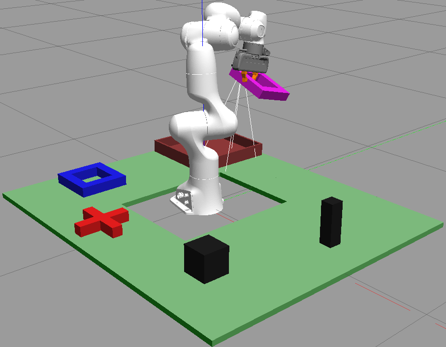
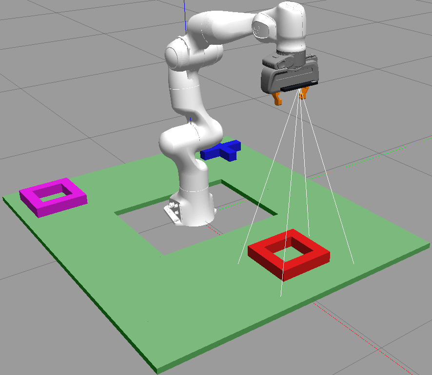
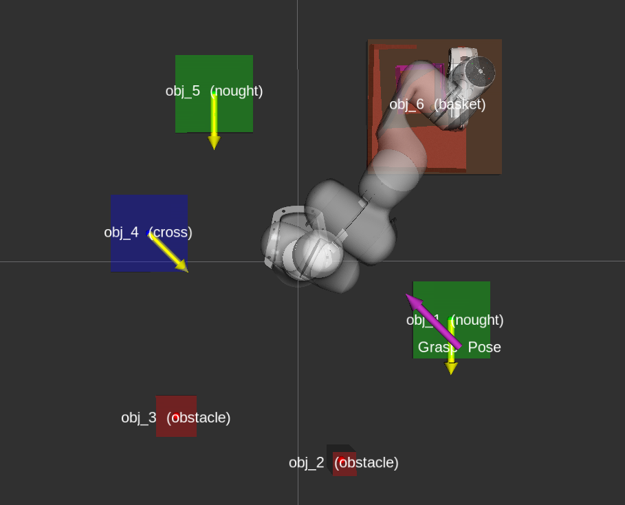

# Pick-n-Place manipulation using 7-DOF Panda robot arm

This repository contains the implementation of a robotic perception and manipulation system that detects, classifies, and manipulates shapes in a simulated Gazebo environment using a Franka Emika Panda robot arm.

## Project Overview

This project demonstrates advanced robotics capabilities through three progressively complex tasks:

1. **Precision Pick and Place:** Shape-specific grasp planning of crosses and noughts (tic-tac-toe shapes) for reliable pick-n-place operations.
2. **Adaptive Shape Classification:** Detection and classification of shape types on variable-height surface.
3. **Cluttered Environment Navigation:** Identification and retrieval of objects in complex scenes with obstacles.

  

## Key Features

### Advanced Perception

- Point cloud segmentation and filtering
- 2D/3D shape classification
- Dynamic object detection in varied environments
- Environment-adaptive parameter tuning

### Intelligent Manipulation

- Shape-specific grasp planning
- Orientation-aware approach strategies
- Collision-free path planning
- Adaptive object selection in cluttered scenes

### Robust System Design

- Comprehensive error handling and recovery strategies
- Visualizations for system monitoring
- Dynamic parameter adjustment based on environmental conditions

## Task 1: Pick and Place Shape Manipulation

Task 1 focuses on basic pick and place operations with precise object manipulation. The robot receives coordinates for a shape (cross or nought) and a goal location, and must successfully grasp the object and place it in the designated target position while maintaining stable orientation throughout the movement.

### 1. Observation and Object Detection

The system begins with a structured perception process:
- **Strategic Positioning & Stabilise**: The camera moves to an optimal viewing angle above the target object and pauses for stabilization, ensuring clear point cloud data.
- **Dynamic Cluster Extraction**: Filters the point cloud by height, XY ranges and performs Euclidean clustering
- **Shape Identification**: Uses the specified shape type from the service request for customized grasping

### 2. Shape Orientation Detection

Accurate orientation detection is crucial for proper grasping:
- **Binary Image Projection**: Converts 3D point cloud to 2D binary projection
- **OpenCV Orientation & Contour Detection**: Determines the contour, primary axes and orientation angle
- **Visual Debugging**: Generates annotated images showing detected orientation
- **Grasp Alignment**: Uses orientation data to optimize the grasp approach angle

### 3. Grasp Planning

The system incorporates grasp planning based on shape characteristics:
- **Shape-Specific Grasping**: Applies different strategies for crosses and noughts
- **Orientation-Aware Approach**: Aligns gripper approach with optimal grasping points
- **Pre-grasp Positioning**: Ensures secure positioning before final grasp execution

### 4. Movement Execution

Robust pick and place execution with carefully controlled movements:
- **Pre-grasp Approach**: Precise positioning above the target object
- **Controlled Descent**: Smooth lowering to grasp position with collision avoidance
- **Stable Lifting**: Careful raising of the object to avoid tipping or dropping
- **Transport Trajectory**: Smooth path planning to the goal location
- **Gentle Placement**: Controlled release at the designated target position

### 5. Error Recovery and Robustness

Multiple strategies ensure reliable task completion:
- **Visual Verification**: Confirms object detection before attempting grasp
- **Movement Validation**: Checks successful execution of each motion phase
- **Adaptive Parameters**: Adjusts grasp and movement parameters based on object properties
- **Visualisation Tools**: Real-time visualisation of planned grasp poses for monitoring

### Results

The system detects and analyzes objects precisely, determines optimal grasp points, and executes smooth pick-and-place operations.

  
  
<em>The following figure represents an example of Task 1 while the robot is transporting the object to basket.</em>

### Key Parameters

- **Observation Height**: 0.7m - Optimal camera position for object detection
- **Pre-grasp Offset**: 0.125m - Pre-grasp height offset above object pose for approach
- **Lift Height**: 0.6m - Safe height for transporting objects
- **Drop Height**: 0.4m - Appropriate height for object release

# Task 2: Shape Classification with Variable Table Height 

Task 2 involves the classification of shapes (noughts and crosses) placed on a variable-height table. The robot must analyze multiple reference shapes and identify which one matches the mystery shape, demonstrating robustness to environmental variations.

### 1. Dynamic Table Height Detection

The system dynamically adapts to varying table heights through a robust detection pipeline:
- **Color-based Detection**: Identifies the green table surface using RGB color analysis
- **Statistical Analysis**: Applies 10th percentile filtering to determine reliable table height
- **Automatic Adaptation**: Adjusts perception parameters based on detected height (0-50mm variation)

### 2. Shape Observation Sequence

For reliable shape perception, the system follows a methodical observation process:
- **Strategic Positioning & Stabilise**: The camera moves to an optimal viewing angle above the target object and pauses for stabilization, ensuring clear point cloud data.
- **Height-Adjusted Filtering**: Dynamically sets z-filtering range based on detected table height
- **Matching**: Analyzes reference shapes first and then matches the mystery shape

### 3. Shape Classification Pipeline

Shapes are classified through an advanced computer vision workflow:
- **Point Cloud Clustering**: Isolates individual shapes from the environment
- **Binary Image Projection**: Converts 3D clusters to 2D binary images for analysis
- **Contour Analysis**: Extracts feature information from shape outlines
- **Hole Detection**: Identifies interior contours to distinguish noughts from crosses
- **Topological Classification**: Uses contour hierarchy to detect shape characteristics

### 4. Orientation Detection

The system determines shape orientation for comprehensive analysis:
- **OpenCV Orientation & Contour Detection**: Determines the contour, primary axes and orientation angle
- **Visual Debugging**: Generates annotated images showing detected orientation
- **Rotation-Invariant Classification**: Ensures consistent identification regardless of orientation

### 5. Reference Shape Matching

To identify the mystery shape, the system:
- **Feature Comparison**: Compares classification results between mystery and reference shapes
- **Reference Indexing**: Returns the 1-based index of the matching reference shape

### Results

The system adapts to table heights (0–50mm), reliably classifies shapes, identifies the matching reference, and provides detailed visualisation for robust performance under varying conditions. Appropriate responses are returned.

  
<em>The following figure represents an example of Task2 while the robot completes scanning the scene:</em>

  

    

      
      
Gazebo

    

    

      
      
Rviz

    

  

### Key Parameters

- **Table Color Detection**: RGB values around (168, 198, 168) with adaptable thresholds
- **Height Processing**: 10th percentile filtering for robust surface detection
- **Hole Ratio Threshold**: 0.2 for distinguishing between noughts and crosses
- **Cluster Distance Threshold**: 0.15m for identifying clusters near target points

# Task 3: Most Common Shape Detection and Manipulation in Cluttered Environment

Task 3 involves the detection, classification, and manipulation of shapes in a Tic-Tac-Toe-like cluttered environment. The robot must scan the workspace, identify objects (crosses and noughts), detect obstacles, locate the basket, and then pick one instance of the most common shape type and place it in the basket.

### 1. Environment Scanning

The system performs a thorough scan of the workspace using a predefined set of observation poses:
- 8 strategic positions around the workspace perimeter
- Each position offers an optimal viewing angle to detect objects
- There are overlaps between the poses to ensure robust detections

### 2. Object Detection Pipeline

Objects are detected through a multi-stage perception pipeline:
- **Point Cloud Processing**: Filtering by height range, removing noise, and downsampling
- **Euclidean Clustering**: Segmenting point clouds into individual object clusters
- **Object Classification**: 
  - Obstacles (black objects)
  - Crosses (X shapes)
  - Noughts (O shapes, square with hole)
  - Basket (brown target destination)

### 3. Shape Classification

Our shape classifier uses advanced computer vision techniques:
- **2D Projection**: Converting 3D point clouds to binary images
- **Contour Analysis**: Extracting shape contours and features
- **Hole Detection**: Detecting interior contours to distinguish noughts
- **Orientation Detection**: Determining rotational alignment of shapes

### 4. Object Selection Strategy

The system employs a sophisticated scoring algorithm to select the optimal object to pick:
- **Distance Score**: Preference for objects at an ideal distance (~0.4m)
- **Clearance Score**: Higher values for objects with more free space around them
- **Orientation Score**: Preference for orientations that facilitate easier grasping
- **Size Score**: Larger objects are prioritized for more reliable grasping

### 5. Grasp Planning

Dynamic grasp pose generation customized for each shape type:
- **For Crosses**: 
  - Identifies the best arm to grasp based on orientation
  - Applies shape-specific lateral offsets (0.02m-0.05m) based on cross size
  - Aligns gripper perpendicular to the selected cross arm

- **For Noughts**: 
  - Applies a 45° orientation adjustment to align with edges
  - Uses edge-centered positioning for optimal grip stability
  - Applies size-appropriate lateral offsets (0.05m-0.07m)

### 6. Robust Motion Planning

The system includes multiple fallback strategies to ensure reliable motion execution:
- **Pre-grasp Positioning**: Precise positioning above target objects with collision avoidance
- **Controlled Descent**: Careful lowering to grasp position 
- **Robust Lifting**: Secure lifting with configurable height parameters
- **Transport Planning**: Safe navigation to the basket avoiding obstacles with collision avoidance
- **Error Recovery**: Automatic recovery strategies for failed motion attempts

### 7. Visualisation Tools

The implementation includes comprehensive visualisation for debugging:
- **Marker Arrays**: 3D visualisation of detected objects and their properties
- **Color Coding**: Different colors for crosses (blue), noughts (green), and obstacles (red)
- **Orientation Arrows**: Displaying detected object orientations
- **Grasp Pose Markers**: Visualisation of planned grasp positions

### Results

The system successfully:
- Detects and classifies different shapes with high accuracy
- Handles objects of varying sizes and orientations
- Avoids obstacles while planning paths
- Performs reliable pick and place operations
- Correctly identifies and reports the most common shape type

  
<em>The following figure represents an example of Task2 while the robot is nearing execution completion:</em>

  

    

      
      
Gazebo

    

    

      
      
Rviz

    

  

### Key Parameters

- `grasp_offset`: 0.15m - Safe height for picking objects
- `lift_height`: 0.5m - Height to lift objects above the workspace
- `drop_height`: 0.4 - Height for releasing objects into the basket

## Results & Performance

The system successfully:
- Detects and classifies shapes with high accuracy (99% +)
- Handles objects of varying sizes and orientations
- Navigates cluttered environments while avoiding collisions
- Adapts to changes in the environment (variable table heights)

## Code Availability Notice

This code is currently submitted for academic evaluation. **The source files cannot be shared publicly until the assessment results are released.** Furthermore, public access will be determined based on the university's policy regarding the reuse of coursework for future student cohorts.

---

## Contact

Reach out if you have questions or want to collaborate:

* **GitHub:** [[Your GitHub Profile Link]](https://github.com/nehith23)
* **LinkedIn:** www.linkedin.com/in/nehith-v
* **Email:** ucabvem@ucl.ac.uk

